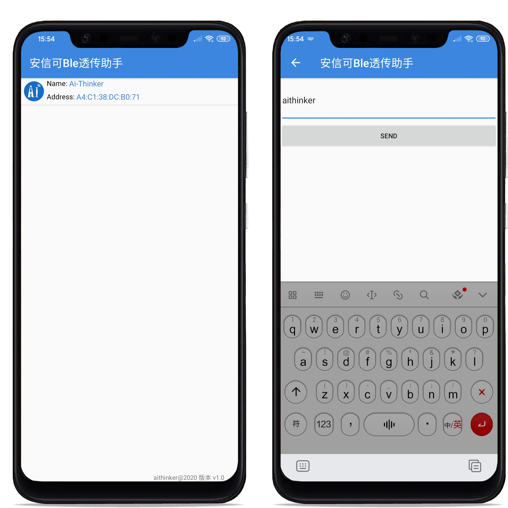

# AndroidBle2TB02

Android APP 蓝牙低功耗控制安信可TB02开发板 ，Android源码；

蓝牙基础库基于第三方库 H-Ble，Android Ble类库，基于回调，暴露搜索、连接、发送、接收、断开连接等接口，无需关心细节操作即可进行Ble通信。

设备端 TB01/02 模块开发板请自行确保是否烧录 AT 透传固件，否则无法通讯！
如需购买 TB01/02 模块开发板请访问安信可官网淘宝店：https://anxinke.taobao.com

**注意：此源码非 Ble Mesh控制，而是普通ble协议控制！**

完整的教程：[如何在Android开发低功耗蓝牙ble控制 TB-02 模块，代码工程全部开源！](https://blog.csdn.net/Boantong_/article/details/105529786)

  

# API

> 
> 具体使用请参考本项目提供的例子
> 

### 获取BleController实例并进行初始化（初始化只需执行一次）

* BleController.getInstance().init(this);

### 搜所设备，获取设备列表
* BleController.getInstance().scanBle(int time,ScanCallback scanCallbak);

### 连接设备
* BleController.getInstance().connect(int time,String deviceAdress,ConnectCallback connectCallback);

### 发送数据
* BleController.getInstance().writeBuffer(byte[] buf,OnWriteCallback onWriteCallback);

### 注册接收数据的监听
* BleController.getInstance().registReciveListener(String requestKey,OnReceiverCallback onReceiveCallback);

### 注销接收数据的监听
* BleController.getInstance().unregistReciveListener(String requestKey);

### 断开连接
* BleController.getInstance().closeBleConn();

---

# 必备操作

### 添加权限

    <uses-permission android:name="android.permission.BLUETOOTH" />
    <uses-permission android:name="android.permission.BLUETOOTH_ADMIN" />
    <uses-permission android:name="android.permission.ACCESS_FINE_LOCATION" />
    <uses-permission android:name="android.permission.ACCESS_COARSE_LOCATION" />

定位权限必须添加,否则Android 5.0以上的手机搜索不到设备

### 指定UUID

* 打开BleController.class
* 修改以下成员变量的值为自己所要通信的TB-02模块对应的UUID
    
        private static final String BLUETOOTH_S = "0000fff0-0000-1000-8000-00805f9b34fb";
    	private static final String BLUETOOTH_NOTIFY_C = "0000fff7-0000-1000-8000-00805f9b34fb";
    	private static final String BLUETOOTH_WRITE_C = "0000fff6-0000-1000-8000-00805f9b34fb";

> 变量名最后一位字母：
> 
> S 代表service的UUID；
> 
> C 代表characteristic的UUID；

---

> 本库满足Android 4.3以上手机和安信可TB-02模块之间的连接与互发数据。
> 
